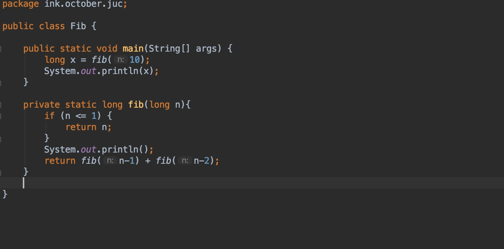
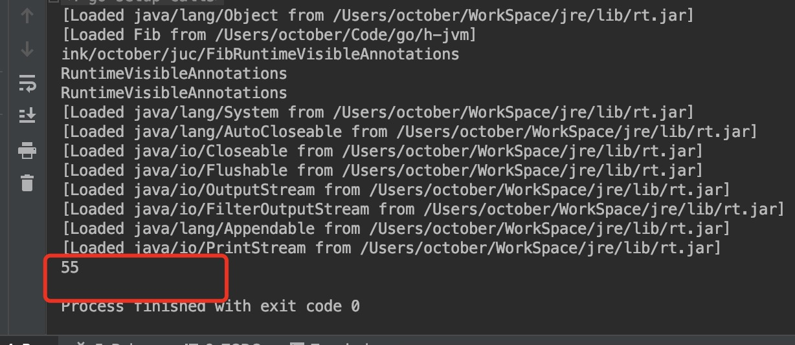

# h-jvm(hydrogen java virtual machine)
一个简单的Java虚拟机（完美运行各种姿势Hello World）

#### 目前已经可以完成的功能
实现方法的调用，可以运行基本运算

计算斐波那契数运行如下：

代码：

运行效果

#### 当前计划实现功能
* ~~类加载~~
* ~~类解析~~
* ~~运行时数据区域~~
* ~~指令集和简单解释器~~
* 异常处理
* 简易GC
* 简易线程

#### 参考资料
* 自己动手写Java虚拟机
* 深入理解Java虚拟机

