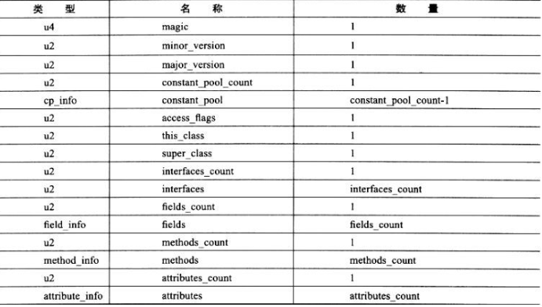
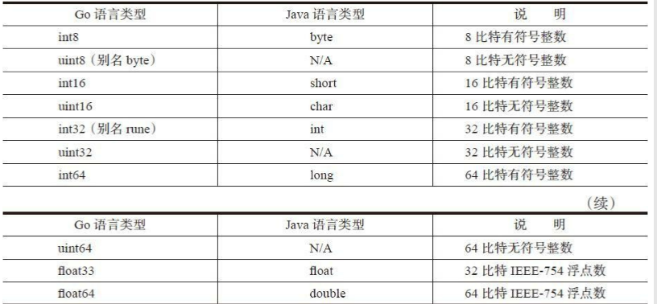

### class文件解析

class文件是一组以8位（1字节）为基础的二进制流，各项数据严格按照顺序紧凑的排列在class文件中，中
间没有任何分割符。根据Java虚拟机规范规定，class文件结构采用一种类似与C语言的结构体按照伪结构来
存储数据，这种伪结构只有两种数据类型：无符号数和表

* 无符号数属于基本的数据类型，以u1、u2、u4、u8来表示1个字节、2个字节、4个字节和8个字节的无符号
数，无符号数可以用来描述数字、索引引用、数量值或者按照UTF-8编码构成的字符串值。
* 表是由多个无符号数或者其他表作为数据项构成的符合数据类型，所有表都习惯性地以“_info”结尾。表
用于描述有层次关系的复合结构的数据，整个Class文件本质上就是一张表，它由下表所示的数据项构成。

我们使用go编写JVM，在go中的语言的基本类型和java的对照如下

